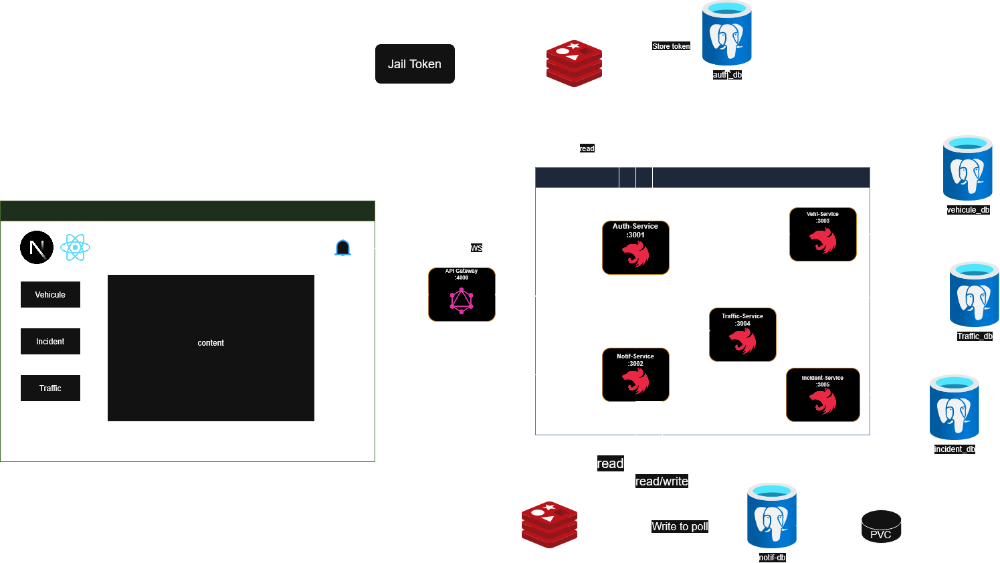

# Urban Traffic Management Platform

A distributed platform for urban traffic supervision — manage vehicles, detect incidents, analyze traffic flow, and receive real-time notifications. Built as part of the Web Services module (GL3).

---

## Architecture

The system is built around a microservices architecture. An **API Gateway** (Express) serves as the single entry point, routing requests to 5 independent NestJS services, each with its own PostgreSQL database. Redis is shared between the Auth and Notif services for JWT blacklisting and notification queuing. The frontend connects to the gateway via HTTP and directly to the Notif service via **WebSocket** for real-time updates.



---

## Requirements

- Docker & Docker Compose
- Node.js 18+ (for local dev without Docker)
- Git

---

## Installation & Usage

```bash
git clone <your-repo-url>
cd ProjetWebService
docker-compose up --build
```

| Service | URL |
|---|---|
| Frontend | http://localhost:3000 |
| API Gateway | http://localhost:4000 |
| Health Check | http://localhost:4000/health |

All API routes are available under `http://localhost:4000/api/v1`:

- `/auth/graphql` — register, login, logout
- `/vehicles/graphql` — vehicle management & GPS history
- `/incidents/graphql` — incident lifecycle
- `/traffic/graphql` — zone density & congestion
- `/notifications/graphql` — notifications

---

## Testing

```bash
cd auth-service && npm run test
cd ../notif-service && npm run test
cd ../vehicle-service && npm run test
cd ../traffic-service && npm run test
cd ../incident-service && npm run test 
```

---

## Eslint for bad block 
```bash
cd auth-service && npx eslint src --ext .ts --fix
cd ../notif-service && npx eslint src --ext .ts --fix
cd ../vehicle-service && npx eslint src --ext .ts --fix
cd ../traffic-service && npx eslint src --ext .ts --fix
cd ../incident-service && npx eslint src --ext .ts --fix
```


## Dockerization

The full stack runs via Docker Compose across two isolated networks — `backend` for internal service communication and `frontend` for external exposure.

```bash
docker-compose up --build   
docker-compose down         
docker-compose logs -f     
```

---

## Postman Collection

Import `ServiceWeb.postman_collection.json` into Postman to test all endpoints. The collection covers auth flows, vehicle/incident/traffic CRUD, and notification queries with pre-configured headers and JWT tokens.

---